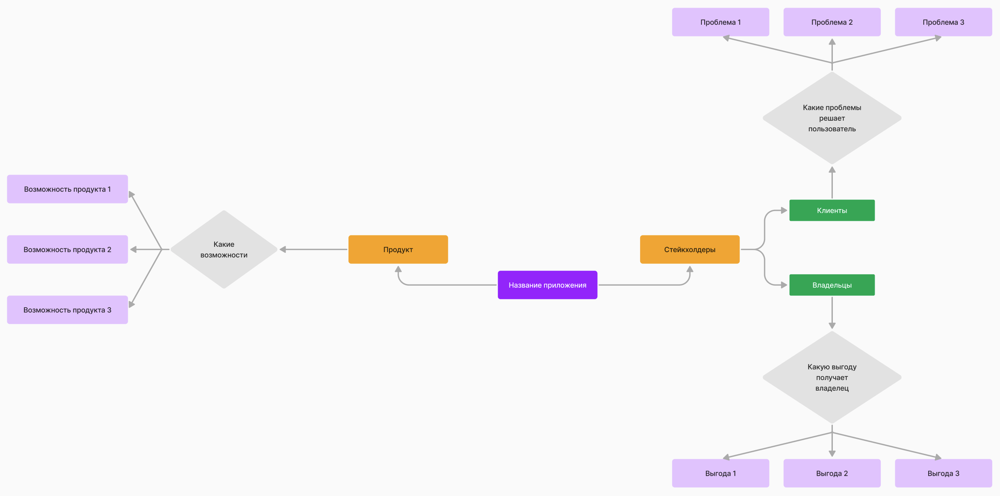
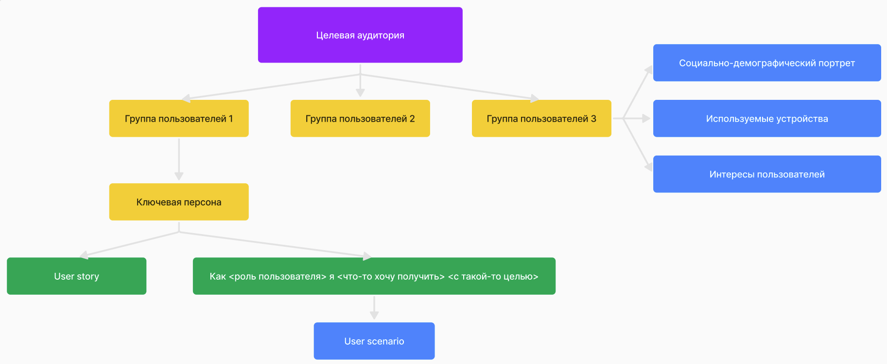

# Шаги создания приложения

## Анализ идеи приложения. Анализ похожих приложений.

На этом этапе нужно получить ответы на вопросы:

1. Какую проблему будет решать приложение?
2. Зачем приложение нужно мне? Как оно будет приносить прибыль? (если она подразумевается)
3. Какие приложения схожей тематики уже существуют?

Результат - понимание что кому для чего и почему мы делаем, отражен в виде диаграммы.

## Анализ ЦА приложения.

На этом этапе нужно получить ответы на вопросы:

1. Кто целевая аудитория приложения?
2. Какие группы пользователей можно выделить из целевой аудитории?
3. Для каждой группы пользователей нужно составить Ключевые персоны.
4. Для Ключевых персон составляем User story по принципу. "Как <роль пользователя>, я <что-то хочу получить> <с такой-то целью>"
5. От User story переходим к составлению User scenario. Это подробный путь пользователя в приложении, который он сделает для достижения своей цели.

Результата - User scenario, для каких платформ разрабатываем приложение. User scenario должны быть зафиксированы в виде схем. Какие разрешения поддерживаем.

## Построение гипотез

1. Нужно определить какие цели и в какие сроки преследуем
2. Составить роадмап развития проекта

## Проектирование ИТ системы

1. Примерная схема самой системы
2. Первычная оценка объема работ

## Прототипирование интерфейса приложения

Результат - Wireframe. Какие экраны и точки входа в приложение будут. Также на них накладывается User flow.

## Стилизация.

Результат - несколько экранов, оформленные в фирменном стиле.

## Дизайн.

Результат - готовые макеты приложения.

## Разработка

## Тестирование

[Ссылка про этапы](https://vc.ru/design/58502-etapy-razrabotki-polzovatelskogo-interfeysa-kak-sdelat-tak-chtoby-ui-ne-lishil-vas-pribyli)

[Ссылка про анализ](https://livetyping.com/ru/blog/predproectnaya-analytica-cho-eto-u-zachem-vam-eto-nugno)
