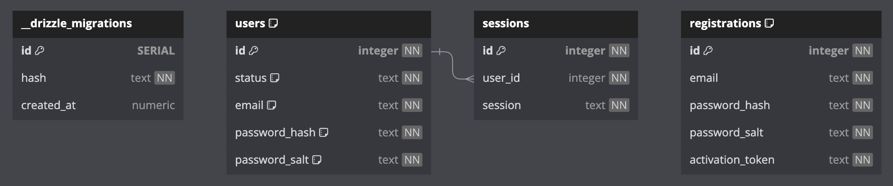

# Database

БД через volume есть на сервере /var/www/databases/starter-bun-database.sqlite

## Как получить визуальное отображение схемы таблицы:

+ sqlite3 'database.sqlite' .schema > out.sql
+ заменить ` на "
+ https://dbdiagram.io
+ import -> from postgresql

## Текущая схема таблицы:

## S3

Помимо БД используется s3 для хранения файлов

Название бакета - starter

Файлы хранятся по папкам. Имя папки - id пользователя
